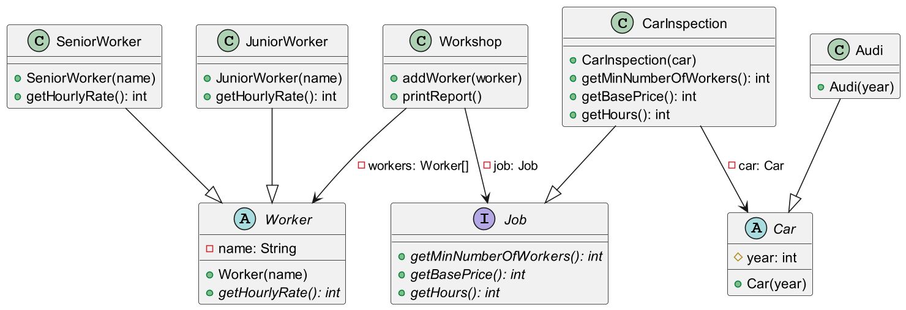

    A car inspection always requires at least two worker
    A car inspection always takes 10 hours, but the hours are split evenly between the workers
        10 hours for a job with two workers is 5 hours for each worker
    A senior worker has a hourly rate of 50
    A junior worker has a hourly rate of 20
    A car inspections costs 200 if the car was build before the year 2000 and 150 if the car was build beginning from the year 2000
    The price of a job the the base price of the job and the hourly rates times the work hours for each worker
    The status of a report is "possible" if the number of workers is equal or more than the required workers, otherwise the status is "not possible"

Extra

    One of the workers for the car inspection has to be a senior worker
    If no senior worker is selected, add the reason "1 senior worker required" to the status
    The status of a report is "possible" if the minimum number of senior workers are selected, otherwise the status is "not possible"

